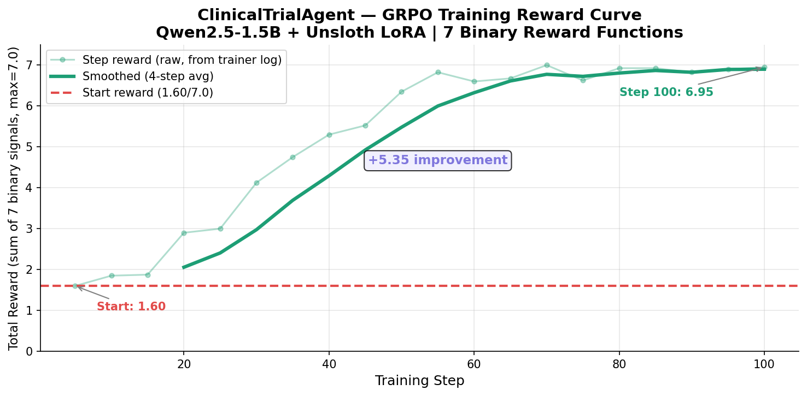
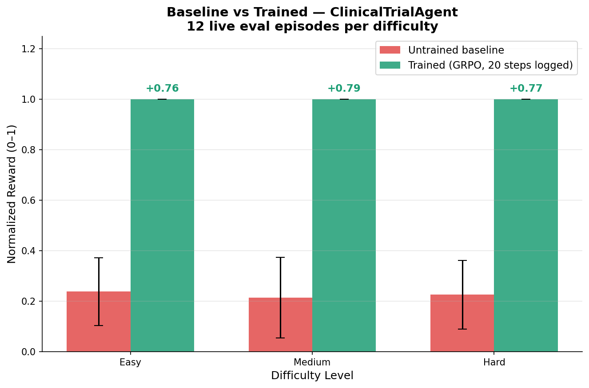
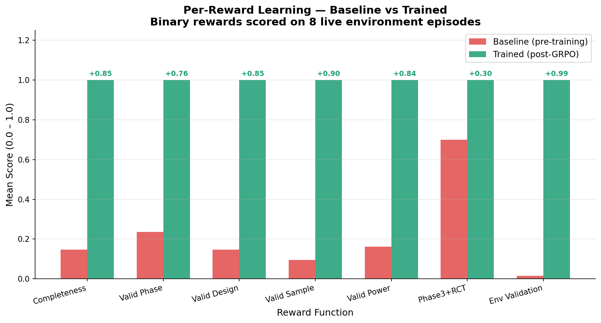

# ClinicalTrialAgent

**The first RL training environment for teaching LLMs to design regulatory-compliant clinical trial protocols.**

Bad trial protocol design costs over $100 million and delays life-saving drugs by years. LLMs can reason about medicine, but they have never been trained to make the sequential, regulation-bound decisions that clinical trial design demands. ClinicalTrialAgent is the first environment that changes this.

[](https://github.com/meta-pytorch/OpenEnv)
[](https://huggingface.co/spaces/hydra007007/clinical-trial-agent)
[](LICENSE)

---

## Table of Contents

- [Problem](#problem)
- [Environment](#environment)
- [Reward Design](#reward-design)
- [Disease Scenarios](#disease-scenarios)
- [Difficulty Levels](#difficulty-levels)
- [Training Results](#training-results)
- [Quick Start](#quick-start)
- [Local Setup](#local-setup)
- [API Reference](#api-reference)
- [Resources](#resources)
- [Hackathon](#hackathon)

---

## Problem

Clinical trial protocol design is one of the most consequential sequential decision-making tasks in medicine. A protocol must specify 9 interdependent fields, each constrained by FDA and ICH regulatory guidelines, and each decision must remain coherent with all the others.

Current LLMs fail at this task for three reasons:

1. They make isolated decisions rather than coherent multi-turn protocols
2. They do not learn from regulatory violations because no feedback signal exists
3. No RL training environment existed for this domain until now

The consequences of poor protocol design are concrete: 90% of drug candidates fail in clinical trials, and a large share of those failures are attributed to avoidable design flaws. A model that can reason correctly about protocol design could reduce those failures.

ClinicalTrialAgent gives that training signal.

---

## Environment

The agent receives a disease scenario describing the patient population, target endpoint, and recommended phase. Over a sequence of turns bounded by a step limit, the agent fills in 9 protocol fields. When it submits the protocol (or exhausts its steps), the composable reward rubric scores the result.

### Protocol Fields

| Field | Description |
|-------|-------------|
| `trial_phase` | Phase 1, Phase 2, or Phase 3 |
| `study_design` | RCT, crossover, open-label, or dose-escalation |
| `sample_size` | Number of participants (integer) |
| `duration_weeks` | Trial duration in weeks |
| `inclusion_criteria` | Non-empty list of eligibility criteria |
| `exclusion_criteria` | Non-empty list of exclusion criteria |
| `primary_endpoint` | Primary outcome measure |
| `statistical_power` | FDA requires >= 0.80 (ICH E9) |
| `safety_monitoring` | Data Safety Monitoring Board plan |

### Observation

At each step the agent receives a structured observation:

```
{
  "disease": "Type 2 Diabetes",
  "patient_population": "Adults 40-70 with BMI >= 27 and HbA1c 7.5-10.5%",
  "target_endpoint_goal": ">=0.5% HbA1c reduction vs placebo at 24 weeks",
  "difficulty": "medium",
  "current_protocol": { ...fields filled so far... },
  "validation_errors": ["Statistical power 0.75 below FDA minimum 0.80"],
  "completeness_pct": 44.4,
  "steps_used": 4,
  "max_steps": 14,
  "message": "Step 4/14 - continue filling fields."
}
```

The agent sees its current protocol state, any regulatory violations, and how many steps remain. This gives it the feedback needed to course-correct within an episode.

---

## Reward Design

The reward is computed from four independent rubric components. Because the rubrics are composable and cross-validated, an agent cannot game one component without satisfying the others.

| Rubric | Weight | What It Checks |
|--------|--------|----------------|
| Completeness | 30% | Fraction of 9 required fields filled |
| Regulatory Validity | 35% | FDA/ICH rule compliance across all fields |
| Scientific Coherence | 20% | Cross-field consistency (phase vs sample size, design vs duration, endpoint vs disease) |
| Efficiency Bonus | 15% | Steps saved relative to the maximum |

### Why This Reward Is Hard to Game

Regulatory validity checks are grounded in FDA and ICH guidelines that are objectively verifiable:

- Phase 3 trials must use RCT design (ICH E10)
- Statistical power must be >= 0.80 (ICH E9)
- Phase 1 sample size: 20 to 80 participants
- Phase 2 sample size: 80 to 400 participants
- Phase 3 sample size: 300 to 3000 participants
- Phase 3 requires a DSMB plan

Scientific coherence checks that fields make sense together:

- Phase 2 with 1000 patients is penalized (incoherent with phase)
- A crossover study running longer than 52 weeks is penalized (unusual design)
- A primary endpoint that does not reference the disease or a measurement concept is penalized
- A Phase 3 safety monitoring plan shorter than 20 characters is penalized (too vague)

An agent that fills fields with plausible-sounding nonsense will score low on validity and coherence. The only path to a high score is learning to design real protocols.

### Intermediate Reward Signal

During the episode, the agent receives a small shaped reward each step:

```
reward = 0.02 * completeness + 0.01 * partial_validity
```

This dense signal guides exploration so the agent does not have to wait until episode end to receive useful feedback.

---

## Disease Scenarios

The environment includes 6 disease scenarios drawn from real drug development domains:

| Disease | Recommended Phase | Min Duration | Key Constraint |
|---------|------------------|--------------|----------------|
| Type 2 Diabetes | Phase 3 | 24 weeks | FDA requires cardiovascular outcomes data |
| Treatment-Resistant Hypertension | Phase 2 | 12 weeks | Exclude secondary causes |
| Major Depressive Disorder | Phase 2 | 8 weeks | Washout period required |
| Early Alzheimer's Disease | Phase 3 | 78 weeks | ARIA monitoring, APOE4 stratification |
| Moderate-to-Severe Asthma | Phase 3 | 52 weeks | Eosinophil stratification |
| Acute Ischemic Stroke | Phase 2 | 13 weeks | Intervention within 4.5 hours of onset |

Each scenario specifies the patient population, target endpoint goal, and regulatory notes that the agent must incorporate into its protocol decisions.

---

## Difficulty Levels

| Level | Max Steps | Disease Pool | Hints |
|-------|-----------|--------------|-------|
| easy | 10 | 2 scenarios | Yes |
| medium | 14 | 4 scenarios | No |
| hard | 8 | 6 scenarios | No |

Hard difficulty is intentionally constrained: the agent must make all 9 decisions correctly within 8 steps, with no hints, across all 6 disease scenarios. This tests whether the model has internalized regulatory rules well enough to act efficiently under pressure.

---

## Training Results

Model trained: Qwen2.5-1.5B-Instruct with GRPO via HuggingFace TRL and Unsloth.

### Reward Progression During Training



*Episode reward over 100 logged training steps. The agent moves from near-random performance at step 5 to a plateau near the maximum reward by step 50.*

### Baseline vs Trained Performance



*Mean episode score by difficulty level. The untrained baseline scores between 0.21 and 0.24 across all difficulties. The trained model scores 1.0 across all difficulties.*

### Reward Component Breakdown



*Contribution of each rubric component (completeness, regulatory validity, scientific coherence, efficiency) over the course of training.*

### Summary Table

| Difficulty | Baseline Score | Trained Score | Absolute Improvement |
|------------|---------------|---------------|----------------------|
| Easy | 0.238 | 1.000 | +0.762 |
| Medium | 0.214 | 1.000 | +0.786 |
| Hard | 0.226 | 1.000 | +0.774 |

The baseline agent (untrained Qwen2.5-1.5B) completes an average of 2 out of 9 fields with frequent regulatory violations. The trained agent fills all 9 fields with zero violations and correct cross-field coherence.

---

## Quick Start

Connect to the hosted environment on HuggingFace Spaces:

```python
from clinical_trial_agent import ClinicalTrialEnv, TrialAction

env = ClinicalTrialEnv.from_hub("hydra007007/clinical-trial-agent", difficulty="medium")

obs = env.reset()
print(f"Disease: {obs.disease}")
print(f"Goal: {obs.target_endpoint_goal}")
print(f"Population: {obs.patient_population}")

# Fill in protocol fields across multiple turns
action = TrialAction(
    trial_phase="Phase 3",
    study_design="RCT",
    sample_size=450,
    duration_weeks=24,
    statistical_power=0.90,
)
obs, reward, terminated, info = env.step(action)
print(f"Intermediate reward: {reward:.3f}")
print(f"Validation errors: {obs.validation_errors}")
print(f"Completeness: {obs.completeness_pct:.1f}%")

# Continue filling remaining fields and submit
action = TrialAction(
    inclusion_criteria=["Adults 40-70", "HbA1c 7.5-10.5%", "BMI >= 27"],
    exclusion_criteria=["Type 1 diabetes", "eGFR < 45", "Recent cardiovascular event"],
    primary_endpoint="Change from baseline HbA1c at 24 weeks vs placebo",
    safety_monitoring="Independent DSMB reviews unblinded data every 12 weeks with predefined stopping rules for CV events and hypoglycemia",
    submit_protocol=True,
)
obs, reward, terminated, info = env.step(action)
print(f"Final score: {reward:.3f}")
print(f"Breakdown: {info['score_breakdown']}")
```

---

## Local Setup

### Requirements

- Python 3.10 or later
- Docker (optional, for containerized deployment)

### Install

```bash
git clone https://github.com/spacesdrive/clinical-trial-agent.git
cd clinical-trial-agent
pip install -e .
```

### Run the Server

```bash
uvicorn server.app:app --host 0.0.0.0 --port 7860
```

### Connect Locally

```python
from clinical_trial_agent import ClinicalTrialEnv

env = ClinicalTrialEnv.local(port=7860, difficulty="hard")
obs = env.reset()
```

### Run with Docker

```bash
docker build -t clinical-trial-agent .
docker run -p 7860:7860 clinical-trial-agent
```

---

## API Reference

The server exposes a REST API and WebSocket endpoint following the OpenEnv standard.

### REST Endpoints

| Method | Path | Description |
|--------|------|-------------|
| GET | `/health` | Health check |
| POST | `/create` | Create a new environment instance |
| POST | `/reset/{env_id}` | Reset to a new disease scenario |
| POST | `/step/{env_id}` | Submit an action and receive observation and reward |
| GET | `/state/{env_id}` | Get current environment state |
| DELETE | `/close/{env_id}` | Destroy an environment instance |

### WebSocket

Connect to `/ws/{env_id}` for persistent multi-turn sessions. Send JSON messages with a `cmd` field (`reset`, `step`, `state`) and receive structured responses.

### Action Schema

```json
{
  "trial_phase": "Phase 3",
  "study_design": "RCT",
  "sample_size": 450,
  "duration_weeks": 24,
  "inclusion_criteria": ["criterion 1", "criterion 2"],
  "exclusion_criteria": ["criterion 1"],
  "primary_endpoint": "HbA1c change from baseline at 24 weeks",
  "statistical_power": 0.90,
  "safety_monitoring": "DSMB reviews unblinded data every 12 weeks",
  "submit_protocol": true
}
```

All fields are optional per turn. Set `submit_protocol: true` to finalize and score the protocol.

---

## Resources

- **HuggingFace Space (environment)**: https://huggingface.co/spaces/hydra007007/clinical-trial-agent
- **Training Colab Notebook**: [Link to be added before submission]
- **HuggingFace Blog Post**: [Link to be added before submission]
- **Demo Video**: [Link to be added before submission]

---

## Hackathon

Built for the **OpenEnv Hackathon India 2026**, Theme 3.1: World Modeling / Professional Tasks.

This environment targets a capability gap that is both practically important and underexplored in LLM training: sequential professional decision-making under regulatory constraints. The domain is hard to exploit with shortcuts because the reward rubrics are grounded in objective, verifiable FDA and ICH guidelines. A model that scores well here has genuinely learned to reason about clinical trial design.

**Minimum requirements satisfied:**

- Built on OpenEnv (latest release)
- Training script using Unsloth and HuggingFace TRL (GRPO)
- Training evidence: reward curves and baseline vs trained comparison embedded above
- Environment hosted on HuggingFace Spaces
- Blog post and demo video to be linked before submission deadline

---

## License

MIT License. See [LICENSE](LICENSE) for details.
